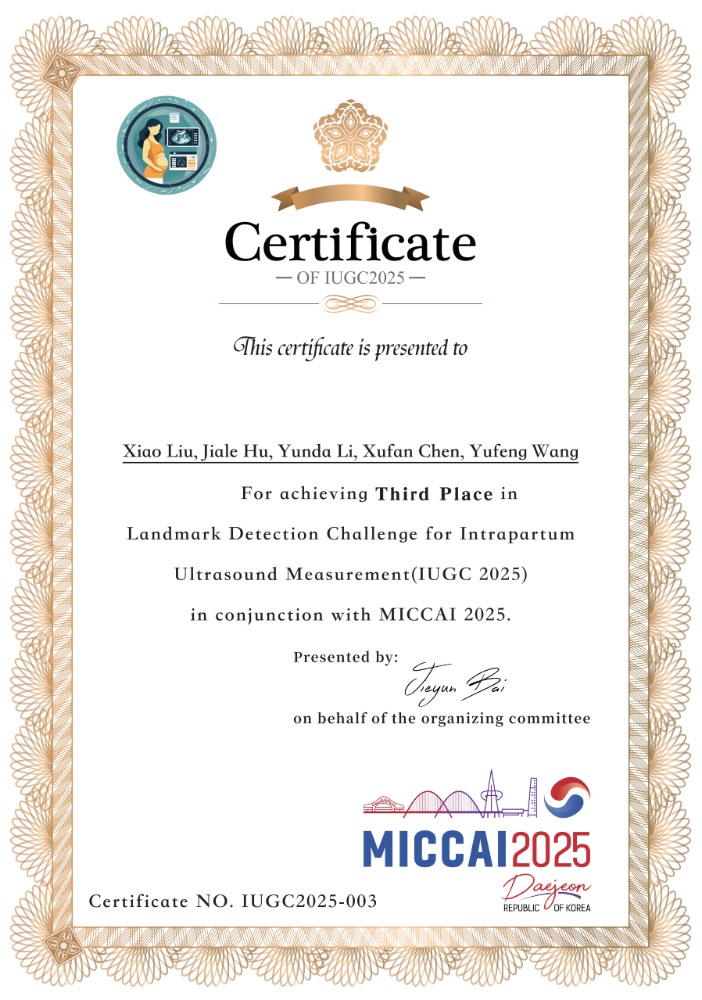
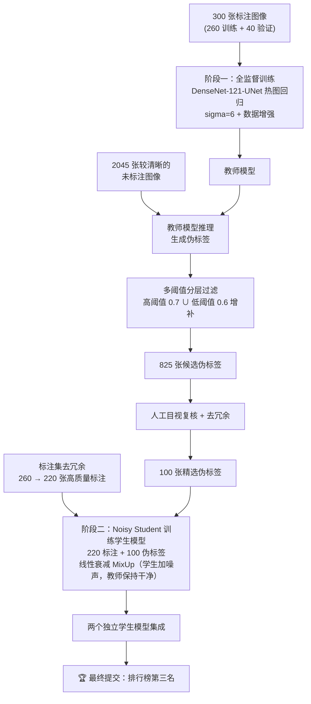

# IUGC 2025 · 产时超声关键点检测挑战赛 —— 第三名解决方案

本项目是 **DL-ICG 团队** 参加 **MICCAI 2025 产时超声测量标志物检测挑战赛（Landmark Detection Challenge for Intrapartum Ultrasound Measurement, IUGC 2025）** 的完整解决方案，最终在挑战赛排行榜上取得 **第三名**。
[比赛官网](https://www.codabench.org/competitions/7108/) | [官方基线](https://github.com/0oTyTo0/IUGC2025)

## 🏆 获奖证书

<p align="center">
  
</p>

## 📑 目录

- [比赛任务与核心挑战](#比赛任务与核心挑战)
- [解决思路总览](#解决思路总览)
- [关键技术细节](#关键技术细节)
- [关键实验结论](#关键实验结论)
- [环境与安装](#环境与安装)
- [训练与复现](#训练与复现)
- [目录结构](#目录结构-1)
- [致谢](#致谢)

---

## 比赛任务与核心挑战

在产时分娩过程中，**胎头下降角（Angle of Progression, AoP）** 是评估产程进展的关键量化指标。其计算依赖于在产时超声图像中定位三个关键解剖标志点：

- **PS1 / PS2**：母体耻骨联合（Pubic Symphysis）弧形轮廓上相距最远的两个端点；
- **FH**：从 PS1 出发向胎头（Fetal Head）轮廓所引切线的切点。

由 PS1、PS2、FH 三点构成的夹角即为 AoP。比赛要求开发全自动算法，直接从超声图像中精准定位三个标志点并自动计算 AoP。

**本任务面临的双重数据困境：**

| 挑战 | 具体情况 |
| --- | --- |
| 标注极度稀缺 | 全场约 3 万余张超声图像中，仅 **300 张**带标注（260 张训练 + 40 张验证） |
| 未标注数据冗余严重 | 图像多由视频截取而来，大量图像仅在拍摄角度上轻微不同，彼此高度相似 |

**我们在实践中进一步识别出三大核心难点：**

1. **大量相似图像的过拟合风险** —— 训练集中若充斥角度雷同的图像，模型会过拟合该类图像、泛化性下降；但一味保留差异大的图像，又会导致困难场景学习不足；
2. **标注 / 未标注数据的数量失衡** —— 即使伪标签质量很高，简单地将海量未标注图像与少量标注图像混合训练，依然会放大伪标签偏差；
3. **关键点检测天然不适配基于 Softmax 最大值的伪标签筛选** —— 热图响应强度与实际定位精度严重脱耦：高响应可能出现在错误位置（假阳性），而定位准确的点却可能因图像噪声、低对比度导致响应偏低而被错误过滤。

## 解决思路总览

我们的方案分为两个阶段：**先建立尽可能强的全监督基线，再以 Noisy Student 半监督框架提取未标注数据的语义信息**。



### 阶段一（6 月）：从通用视觉关键点检测迁移，建立全监督基线

比赛初期，我们从计算机视觉视角切入——将本任务视为一个半监督的关键点检测问题，核心假设是：**热图回归、后处理策略等关键点检测的基本范式在自然图像与医学超声图像之间具有高度可迁移性**。

- **架构探索**：受 2023 年头颅关键点检测比赛 Top2 方案（HRNet + 金字塔结构 + DARK 后处理）启发，我们首先尝试将 HRNet 迁移至超声图像，但效果不如基础 UNet，果断放弃，回归官方基线的 UNet 热图回归路线；
- **骨干网络实验**：系统评估了 ResNet-18/34、ConvNeXt-Tiny、PVT-v2-b1、DenseNet-121 等多种骨干替换 UNet 编码器，均带来不同程度提升；
- **关键调优——sigma**：将高斯热图生成的 `sigma` 从默认值 `2.0` 调整为 `6` 后，**MAE 从 18 显著降至 16**，一度使我们跃居排行榜第一；
- **数据增强**：借鉴 2024 年头颅检测比赛冠军方案并针对 2D 超声图像适配简化，最终采用：仿射变换、亮度调整、高斯模糊、伽马对比度校正、弹性形变。

### 阶段二（7 月）：Noisy Student 半监督框架 + 数据治理

**半监督方法选型**：我们首先尝试将端到端半监督分割方法 UniMatchV2 迁移到关键点检测，但由于其损失函数与热图回归常用的 MSE 损失存在本质差异而失败；转而采用更直接的 **伪标签 + Noisy Student** 路线（参考 Google 论文《Self-training with Noisy Student Improves ImageNet Classification》）。

Noisy Student 的核心机制是：**学生模型训练时必须注入噪声（数据增强、MixUp 等），而教师模型生成伪标签时必须保持"干净"**——这迫使学生学习更鲁棒、更具泛化能力的特征，而不是记忆或放大伪标签中的噪声。

**模型重构（应对推理时间限制）**：比赛最终测试阶段推理时间限制严格，原先计划集成的 PVT-v2-b1 + ConvNeXt-Tiny 组合因计算量过大而超时。受一次分割实验的意外发现（UNet 通道数扩至 1024 时性能优于许多先进模型）启发，我们意识到**更强的特征表达能力可能比复杂的 Backbone 更重要**。经系统对比，最终确立 **DenseNet-121-UNet** 为主干——DenseNet 在分类任务中表现平庸，但其密集连接结构能有效传递多尺度特征，特别适合超声图像中低对比度、高噪声的关键点定位任务。

**针对三大核心难点的数据治理**：

1. **相似图像处理**：通过对照分析带标注与未标注数据，找出与带标注数据十分相似的未标注图像，将其伪标签作为高质量伪标签优先纳入训练集；
2. **数据平衡**：实验发现减少部分冗余标注样本反而能降低 Distance——说明原始标注集中存在大量相似样本导致过拟合。因此对标注集同样去冗余，从 260 张精简至 **220 张**（移出的 40 张转入验证集，更真实地评估泛化能力）；
3. **伪标签筛选**：设计多阈值分层过滤策略（详见下文），从 2045 张未标注图像中先筛出 825 张候选，再经人工复核与去冗余最终精选 **100 张**高解剖合理性伪标签。825 张候选还被划分为五个互不重叠的子集，在不同训练阶段交替使用以提升多样性。

**最终训练集构成：220 张高质量标注图像 + 100 张精选伪标注图像。**

## 关键技术细节

### 1. DenseNet-121-UNet 热图回归主干

DenseNet121 编码器 + U-Net 风格解码器。与直接回归坐标不同，模型为每个关键点（K=3）预测一张高斯热图，通过热图峰值坐标解码最终定位。热图尺寸与 `sigma` 均可通过配置调整（`sigma=6` 是我们最重要的调参发现）。

### 2. 多阈值分层伪标签筛选

针对热图响应强度与定位精度脱耦的问题，设计了务实有效的过滤策略：

```
第一步：以较高阈值（0.7）筛选高置信度样本；
第二步：从较低阈值（0.6）生成的候选集中剔除上述已选样本；
第三步：保留未被高阈值覆盖、但空间分布更广泛的中等置信度样本，
        以增强数据多样性、避免系统性偏向"易检测"结构；
结果：2045 张未标注图像 → 825 张候选伪标签；
第四步：人工目视复核 + 去冗余 → 100 张精选伪标签。
```

### 3. 热图版 MixUp（关键创新）

标准 MixUp 面向分类（one-hot 标签）或坐标回归（连续坐标），无法直接用于热图回归。我们对其进行了适配：

- **图像层面**：按比例 `λ` 混合两张输入图像；
- **标签层面**：将两个样本对应的高斯热图也按相同比例 `λ` 混合，生成"软"热图标签；
- **通道设计**：模型输出通道扩展为 `2K`（K 为关键点数），训练时仅使用前 `K` 个通道计算 MSE 损失。

这样 MixUp 不仅增强了数据多样性，还为模型提供了更平滑的监督信号，有效缓解了伪标签偏差带来的负面影响。

### 4. 线性衰减 MixUp 策略

实验发现固定概率应用 MixUp 会让模型在训练后期过度依赖增强样本，限制精细定位特征的学习。为此提出**线性衰减策略**：

- MixUp 强度 `α = 0.2`；
- 应用概率从 `0.9` 随训练进程**线性衰减至 `0.2`**。

模型在早期充分学习鲁棒性特征，后期专注高精度定位，有效平衡了泛化能力与收敛质量。

## 关键实验结论

| 实验 | 结论 |
| --- | --- |
| HRNet 迁移至超声图像 | 效果不如基础 UNet，放弃 |
| 余弦退火调度器替代 StepLR | 无明显收益，放弃 |
| UniMatchV2 迁移至关键点检测 | 损失函数与热图回归 MSE 不适配，失败 |
| 基于热图最大激活值的伪标签筛选 | 高响应 ≠ 定位准确，噪声极高，弃用 |
| CutMix 增强 | 随机遮挡图像区域，极易覆盖关键点位置，训练不稳定，放弃 |
| `sigma` 2.0 → 6 | **MAE 从 18 降至 16**，一度登顶排行榜 |
| PVT-v2-b1 + ConvNeXt-Tiny 集成 | 推理超时，放弃 |
| DenseNet-121-UNet | **最终主干网络** |
| 固定概率 MixUp | 有提升，但后期存在轻微过拟合风险 |
| 线性衰减 MixUp（0.9 → 0.2） | **最终采用**，泛化与精度兼得 |
| 两个独立学生模型集成 | **最终提交方案，排行榜第三名** |

## 环境与安装

```bash
conda create -n iugc python=3.10
conda activate iugc
pip3 install torch torchvision torchaudio --index-url https://download.pytorch.org/whl/cu118
pip install -r requirements.txt
```

## 训练与复现

全流程由 `config/*.yaml` 配置文件驱动，固定随机种子，并提供教师模型与最终模型权重，可完整复现提交结果。

**1. 全监督训练（教师模型 / 阶段一）：**

```bash
python heatmap_train_only_3.py \
  --config ./config/densenet121_unet.yaml \
  --train_csv ./inputs/label.csv \
  --train_dir "./inputs/Labeled cases" \
  --val_csv ./inputs/val_label.csv \
  --val_dir ./inputs/val_images \
  --heatmap_size 128 --sigma 6 --num_keypoints 3
```

**2. 伪标签生成与筛选：**

```bash
# 教师模型对未标注图像推理，生成伪标签候选
python pseudo_inference.py
# 结合 pse_utils.py 按多阈值策略过滤，再人工复核精选
```

**3. Noisy Student 半监督训练（学生模型 / 阶段二）：**

```bash
# MixUp 线性衰减版训练脚本（最终方案）
python heatmap_train_only_3_mixup_prob_moda.py \
  --config ./config/densenet_121_unet_prob.yaml
```

其他可用变体：`heatmap_train_only_3_depsup.py`（深度监督版）、`heatmap_train_only_3_mixup_moda.py`（固定概率 MixUp 版）、`heatmap_utils_DARK.py`（DARK 后处理工具）。骨干网络可通过切换配置文件实验：`config/` 下提供 `pvt_b1_unet.yaml`、`convnextv2_tiny.yaml`、`resnet_unet.yaml`、`seresnext26d_unet_prob.yaml` 等多种配置。

## 目录结构

```
IUGC2025/
├── config/                          # 训练配置文件（YAML，全流程配置驱动）
├── models/                          # 模型定义（DenseNet/PVT/ConvNeXt/HRNet 等编码器 + UNet 解码器）
├── final_test_submmit_files/        # 最终测试提交相关文件
├── IUGC2025.png                     # 挑战赛获奖证书
├── dataset_preprocessing_utils.py   # 数据预处理工具
├── heatmap_dataset3.py              # 热图数据集加载
├── heatmap_train_only_3.py          # 全监督热图回归训练脚本
├── heatmap_train_only_3_depsup.py   # 深度监督训练脚本
├── heatmap_train_only_3_mixup_moda.py       # MixUp 增强训练脚本
├── heatmap_train_only_3_mixup_prob_moda.py  # 线性衰减 MixUp 训练脚本（最终方案）
├── heatmap_utils_DARK.py            # DARK 关键点后处理
├── pseudo_inference.py              # 伪标签推理
├── pse_utils.py                     # 伪标签筛选工具
├── requirements.txt                 # 第三方依赖
└── README.md
```

## 致谢

- 感谢 IUGC 2025 挑战赛主办方（奥克兰大学 / 暨南大学）提供数据与竞赛平台；
- 半监督框架参考：[Self-training with Noisy Student Improves ImageNet Classification](https://arxiv.org/abs/1911.04252)（Google Research）与 [Noisy Student 官方实现](https://github.com/google-research/noisystudent)；
- 数据增强与调参思路部分借鉴历年头颅关键点检测挑战赛优胜方案。

---

<p align="center">
  <sub>项目负责人：刘肖 · DL-ICG 团队 · MICCAI 2025 IUGC 挑战赛第三名</sub>
</p>
